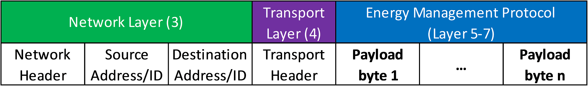

# Application layer


## OSI layer setup

The application layer specification of the energy management protocol will specify layers 5 to 7 of the [OSI (Open Systems Interconnection) model](https://en.wikipedia.org/wiki/OSI_model).



The application layer payload shall be the same data independent of the lower layer protocols.

Layers 1-4 depend on the lower layer protocols used. In case of a simple serial connection between two devices, no transport and netork layers are needed. The energy management protocol payload as specified below is directly transferred over the line.

For IP based networks (over Ethernet or Wifi), the network layer will be the IP protocol. The source and destination addresses are IP addresses in this case. The transport layer might be TCP or UDP, adding additional headers to the entire protocol frame.

In contrast to that, the original CAN specification does not define any source or destination addresses or a transport protocol layer. Thus, a 1-byte source ID and a 1-byte destination ID will be encoded in the 29 bit CAN extended identifier. In addition to that, parts of the application protocol will be encoded in the remaining bits of the CAN identifier. For further details please refer to the low layer specification based on CAN bus.

## Function Overview

Each protocol function is associated to a unique function ID, which defines the layout of the payload and the actions to be performed. 

The different functions are encoded using 1 byte. IDs 0-127 are used for requests, 128-255 for responses.

The ID for a response is calculated by adding 128 to the ID of the request. This is equal to changing the most significant bit from 0 (request) to 1 (response).

Two types of data representation are possible, either JSON-based ASCII format or a binary encoding. Each device must implement the binary encoding of the protocol, as the ASCII variant might not be feasible for ressource-constrained embedded devices. The ASCII version is optional, but recommended when using USB or serial interfaces as the low layer protocol. The ASCII protocol is human-readable and can be easily used directly on a terminal.

## Data Objects

All data associated to a device is structured in so-called data objects. A data object might be a measurement value like the output current of a device or the voltage setpoint of a charger (user-configurable data).

Each data object is identified by a unique Data Object ID. The ID can be arbitrarily chosen by the firmware developer. In addition to that, each data object has a unique name. The name is a short string without blanks, e.g. "vBat" for the battery voltage.

For reduced memory useage, [lower camel-case style](https://en.wikipedia.org/wiki/Camel_case) should be used for the data object names. The first letter(s) should specify the type of value:

- v for voltage
- e for energy
- i for current
- t for time
- temp for temperature

The numeric IDs are only used in the binary protocol for increased efficiency and performance. For all interactions with user devices, only the object name should be used. The numeric IDs are not used at all in the ASCII protocol.

Data object IDs are encoded using a 16-bit number. Valid numbers are 0...65536.

*ToDo: Maybe reserve some values for special cases and future use*

### Units

All data communicated with the outside world must use SI units, so it is not necessary to specify the unit of each data object. The data types (see below) are used for scaling of the data. 

If the basic SI unit for a given measurement value is not common or not feasible (e.g. use of kWh for energy instead of Ws), the unit must be explicitly defined with an underscore in the name of the data object, e.g. "eBattery_kWh" for the battery energy content in kWh. Units which cannot be derived from the SI basic units (e.g. °F) are not allowed.

*ToDo: What about nautical miles and knots...? makes a lot of sense to allow for maritime applications. But it's not at compatible with SI system...*

For temperatures, Kelvin (K) is the official SI unit. However, °C is compatible with K and is allowed, if 

It is NOT allowed to publish a voltage in millivolts (mV) instead of volts (V), as scaling on the basis of 10 shall be defined using the correct data type (see below).

### Data types

The data type of each variable is encoded in a 6-bit number stored in one uint8 byte (only the values 0-63 are valid). The following types are possible:

- Void
- Boolean
- Byte (uint8)
- Int 8 + exponent (maybe remove?)
- Int 16 + exponent
- Int 32 + exponent
- Int 64 + exponent
- UInt 8 + exponent (maybe remove?)
- UInt 16 + exponent (maybe remove?)
- UInt 32 + exponent (maybe remove?)
- UInt 64 + exponent (maybe remove?)
- Float 32
- Float 64
- Time stamp
- String (UTF-8)
- Array of above types (?)

Integer values might have the specified size and an additional tail byte defining the exponent to the basis of 10 as an int8 value. For example, a 32bit integer would consume 5 instead of 4 bytes. If the exponent is omitted, it is 0.

The actual value is calculated using the following formula:

```
{int/uint value} * 10^{exponent}
```

*ToDo: Define numbers for each type.*

### Status Code

Each response message contains a status byte to identify if the request could be handled successfully. If the most signigicant bit (number 7) is 0, the response was successful. The remaining bits can be used for other purposes (e.g. for the 6-bit type ID). If the most significant bit is 1, an error occured. The remaining bits are used to specify the error in more detail.

In other words:
- Status Code 0x00-0x7F (0-127): Success
- Status Code 0x80-0xFF (128-255): Error
    - 0x80: General Error
    - 0x81: Function ID unknown
    - 0x82: Device busy
    - 0x83: Unauthorized
    - 0x84: Request too long

### Data object categories

Each data object belongs to one of the following categories (associated to a category ID):

- device_info: Read-only device information (e.g. manufacturer, etc.)
- settings: User-configurable settings (free access, maybe with user password)
- calibration: Factory-calibrated settings (access restricted)
- diagnosis: Error memory, etc., (at least partly access restricted)
- input: free user access
- output: free user access


## Binary Protocol

Numbers are encoded using the little endian format (least significant *byte* first, the bits inside a byte are MSB first). This format is most commonly used by modern computers and microcontrollers, which makes it easy to implement. In addition to that, many CAN based high layer protocols (like CANopen, SAE J1939 and NMEA2000) use little endian encoding.

Example encoding of the bits inside a 32-bit integer:

<table><thead><tr>
    <th>Byte 1</th><th>Byte 2</th><th>Byte 3</th><th>Byte 4</th>
</tr></thead><tbody><tr>
	<td>b7 ... b0</td>
    <td>b15 ... b8</td>
    <td>b23 ... b16</td>
    <td>b31 ... b24</td>
</tr></tbody></table>


### Read data object

Requests to read a given data object.

#### Request

<table><thead><tr>
    <th>Byte 1</th><th>Byte 2</th><th>Byte 3</th>
</tr></thead><tbody><tr>
	<td>Function ID</td>
    <td colspan="2">Data Object ID</td>
</tr></tbody></table>

- Function ID: 0x00 (preliminary)
- Data Object ID: Number between 0 and 65536

#### Response

Responds with an ACK and the requested data or an error code.

<table><thead><tr>
    <th>Byte 1</th><th>Byte 2</th><th>Byte 3</th><th>...</th><th>Byte n+2</th>
</tr></thead><tbody><tr>
	<td>Function ID</td>
    <td>Status | Data Type</td>
    <td>Data 1</td>
	<td>...</td>
	<td>Data n</td>
</tr></tbody></table>

- Function ID: 0x80 (preliminary)
- Status | Data Type: Status code (see above) and data type (bits 0..5) in case of success (bit 7 = 0).
- Data 1...n: Data bytes. No bytes sent in case of error.

### Write data object

Requests to overwrite a data object.

#### Request

<table><thead><tr>
    <th>Byte 1</th><th>Byte 2</th><th>Byte 3</th><th>Byte 4</th><th>Byte 5</th><th>Byte 6</th><th></th><th>Byte n+5</th>
</tr></thead><tbody><tr>
	<td>Function ID</td>
    <td colspan="2">Data Object ID</td>
    <td>Persistence</td>
    <td>Data Type</td>
	<td>Data 1</td>
	<td>...</td>
	<td>Data n</td>
</tr></tbody></table>

- Function ID: 0x01 (preliminary)

#### Response

<table><thead><tr>
    <th>Byte 1</th><th>Byte 2</th>
</tr></thead><tbody><tr>
	<td>Function ID</td>
    <td>Status Code</td>
</tr></tbody></table>

- Function ID: 0x81 (preliminary)

### Publish data object

#### Request

<table><thead><tr>
    <th>Byte 1</th><th>Byte 2</th><th>Byte 3</th><th>Byte 4</th><th>Byte 5</th><th>Byte 6</th><th>Byte 7</th>
</tr></thead><tbody><tr>
	<td>Function ID</td>
    <td colspan="2">Data Object ID</td>
    <td colspan="2">Interval</td>
    <td>Event trigger?</td>
	<td>?</td>
</tr></tbody></table>

- Function ID: 0x02 (preliminary)

#### Response

<table><thead><tr>
    <th>Byte 1</th><th>Byte 2</th>
</tr></thead><tbody><tr>
	<td>Function ID</td>
    <td>Status Code</td>
</tr></tbody></table>

- Function ID: 0x82 (preliminary)
- Status Code: Success or error (see above)

### Subscribe to data object

#### Request

<table><thead><tr>
    <th>Byte 1</th><th>Byte 2</th><th>Byte 3</th><th>Byte 4</th><th>Byte 5</th><th>Byte 6</th><th>Byte 7</th>
</tr></thead><tbody><tr>
	<td>Function ID</td>
    <td colspan="2">Data Object ID</td>
    <td colspan="2">Pub. Data Object ID</td>
    <td>Pub. Address</td>
	<td>Fallback time</td>
</tr></tbody></table>

- Function ID: 0x03 (preliminary)

#### Response

<table><thead><tr>
    <th>Byte 1</th><th>Byte 2</th>
</tr></thead><tbody><tr>
	<td>Function ID</td>
    <td>Status Code</td>
</tr></tbody></table>

- Function ID: 0x83 (preliminary)
- Status Code: Success or error (see above)

### Get data object name

#### Request

<table><thead><tr>
    <th>Byte 1</th><th>Byte 2</th><th>Byte 3</th>
</tr></thead><tbody><tr>
	<td>Function ID</td>
    <td colspan="2">Data Object ID</td>
</tr></tbody></table>

- Function ID: 0x04 (preliminary)

#### Response

<table><thead><tr>
    <th>Byte 1</th><th>Byte 2</th><th>Byte 3</th><th></th><th>Byte n+2</th>
</tr></thead><tbody><tr>
	<td>Function ID</td>
    <td>Status | Data Type</td>
    <td>Data 1</td>
	<td>...</td>
	<td>Data n</td>
</tr></tbody></table>

- Function ID: 0x84 (preliminary)
- Status | Data Type: Status code (see above) and data type (bits 0..5) in case of success (bit 7 = 0).

### List data objects

#### Request

<table><thead><tr>
    <th>Byte 1</th><th>Byte 2</th>
</tr></thead><tbody><tr>
	<td>Function ID</td>
    <td>Category ID</td>
</tr></tbody></table>

- Function ID: 0x05 (preliminary)
- Category ID: Data object category to list objects from (0 for all data objects)

#### Response

<table><thead><tr>
    <th>Byte 1</th><th>Byte 2</th><th>Byte 3</th><th>Byte 4</th><th></th><th>Byte (n\*2)+1</th><th>Byte (n\*2)+2</th>
</tr></thead><tbody><tr>
	<td>Function ID</td>
    <td>Status | Data Type</td>
    <td colspan="2">Data Object ID 1</td>
	<td>...</td>
    <td colspan="2">Data Object ID n</td>
</tr></tbody></table>

- Function ID: 0x85 (preliminary)
- Status | Data Type: Status code (see above) and data type (always uint16)
- Data Object ID 1..n: Lists all valid data object IDs belonging to the requested category.


### ASCII protocol selection

An ASCII protocol request starts with an exclamation mark. Consequently, function code 33 (which is the '!' sign in ASCII) is used to start the ASCII communication protocol.

#### Request

<table><thead><tr>
    <th>Byte 1</th><th>Byte 2</th><th></th><th>Byte n+1</th><th>Byte n+2</th>
</tr></thead><tbody><tr>
	<td>Function ID</td>
    <td>ASCII Data 1</td>
	<td>...</td>
	<td>ASCII Data n</td>
	<td>\n (new line)</td>
</tr></tbody></table>

- Function ID: 0x21 = 33 = '!'

For more information about the ASCII protocol see below.

#### Response

A response in the ASCII protocol will start with a '{', as the serialization is done using JSON. Thus, the function ID with the ASCII character '{' is reserved for this type of response.

- Function ID: 0x7B = 123 = '{'

If the ASCII protocol is not supported, function code 0xA1 shall be used to respond with an error message.

*Maybe also respond with trailing '!' and error code?*

### Other possible functions

- Ping
- Firmware Upgrade
- Authentication
- File Access
- Time Sync?
- Shutdown/Restart
- Heartbeat?


## ASCII Protocol

The specification of the ASCII protocol is still a rough draft.

### Collection of ideas

- All requests start with '!'
- Responses should be valid JSON
- Requests should follow REST API to identify different data objects in a structured way

### Examples of requests

Read all settings of a device.

```
!read /settings/*
```

Write the setting of maximum battery charging voltage.

```
!write {"settings":{"vBatMax":14.4}}
```

Publish measurement data vBat every 100 ms.

```
!pub /measurements/vBat 100
```

Subscribe to external temperature sensor data.

```
!sub /input/temperature /measurements/temp1 192.168.0.2
```

