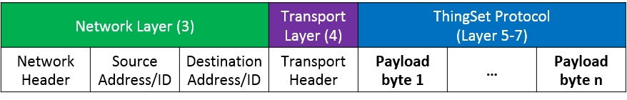

# General Concept

The ThingSet protocol provides a consistent, standardized way to configure, monitor and control ressource-constrained devices via different communication interfaces. It specifies the higher layers (5 to 7) of the [OSI (Open Systems Interconnection) model](https://en.wikipedia.org/wiki/OSI_model). The payload data is independent of the underlying lower layer protocol or interface, which can be CAN, USB, LoRa, WiFi, Bluetooth, UART (serial) or similar.

The underlying layers have to ensure reliable transfer, correct packet order (if messages are packetized) and error-checking of the transferred data.

<!---
## General goals

- "modern" modbus
- Easy to use
- Schema-less and self-explaining
- Help to bootstrap IOT devices

## OSI layer setup

Layers 1-4 depend on the lower layer protocols used. In case of a simple serial connection between two devices, no transport and netork layers are needed. The protocol payload as specified below is directly transferred over the line.

For IP based networks (over Ethernet or Wifi), the network layer will be the IP protocol. The source and destination addresses are IP addresses in this case. The transport layer might be TCP or UDP, adding additional headers to the entire protocol frame.
-->

## Message Types

ThingSet defines three types of messages: Requests, responses and publication messages.

The communication between two specific devices uses a request/response messaging pattern via so-called channels. A communication channel can be established either directly (e.g. serial interface, USB, Bluetooth) or via a network or bus with several devices attached (e.g. CAN, Ethernet, WiFi, LoRa). In case of a network, each device/node has to be uniquely addressable.

The device acts as the server and responds to the requests by a client. The client might be a laptop or mobile phone with a human interface application.

The data transfer is always synchronous: The client sends a request, waits for the response (status code and/or requested data), handles the data of the response and possibly starts with additional requests.

Monitoring data is not intended for only a single device, but could be interesting for several devices (e.g. data logger, display, human interface device, etc.). Thus, the monitoring data is exchanged via a publish/subscribe messaging pattern.

Publication messages are directly broadcast through the network. There is *no* intermediate broker (like in MQTT) to store the messages and published messages are *not* confirmed by recipients, so there is no guarantee if the message was received.

## Protocol Modes

Similar to Modbus, the ThingSet protocol supports two different modes: A human-readable text-based mode and a binary mode.

In the text-based mode, payload data is encoded in JSON format ([RFC 8259](https://tools.ietf.org/html/rfc8259)). This mode is recommended when using USB or serial interfaces as the low layer protocol, as it can be easily used directly on a terminal.

The binary protocol uses the CBOR binary encoding ([RFC 7049](https://tools.ietf.org/html/rfc7049)) instead of JSON payload data in order to reduce the protocol overhead for ressource-constrained devices or low bandwith communication protocols like CAN and LoRa.

Each device must implement the binary encoding of the protocol. The the text-based JSON variant is optional, but recommended.

## Data Objects

All accessible data of a device is structured in so-called data objects. A data object might be any kind of measurements (e.g. temperature), device configuration (e.g. setpoint of a controller) or similar data.

Each data object is identified by a unique Data Object ID. The ID can be chosen by the firmware developer. In addition to that, each data object has a unique name. The name is a short ASCII string without blanks, e.g. "vBat" for the battery voltage.

For reduced memory useage, [lower camel-case style](https://en.wikipedia.org/wiki/Camel_case) should be used for the data object names. The first letter(s) should specify the type of value if applicable:

- v for voltage
- e for energy
- i for current
- t for time
- temp for temperature

The numeric IDs are used in the binary protocol for increased efficiency and performance. For all interactions with users and in the text-based mode, only the object name is used.

### Data object categories

Each data object belongs to one of the following categories (associated to a category ID of 4 bits):

| Category name (JSON) | Category ID | Description | Access  |
|-------------|-------------|-------------|---------|
| *           | 0x0         | Wildcard ID, representing all IDs | |
| info        | 0x1         | Read-only device information (e.g. manufacturer, software version) | |
| setup       | 0x2         | User-configurable settings  | read/write access, may be protected with user password |
| input       | 0x3         | Input channels (e.g. actuators) | write access |
| output      | 0x4         | Output channels (e.g. sensor data) | read access |
| rpc         | 0x5         | remote procedure call | partly access restricted |
| calibration | 0x6         | Factory-calibrated settings | read/write access, protected |
| diagnosis   | 0x7         | Error memory, etc., | read access, at least partly protected |
|             | 0x8-0xE     | Reserved for future use | unknown |
|             | 0xF         | Reserved (termination character in binary protocol) | n/a |

Data object IDs are stored as 16-bit unsigned integers. The ID includes the category ID of 4 bits. The remaining 12 bits can be freely chosen. In total, 4095 different values can be associated via an ID per category, with 0 being the wildcard ID again. The wildcard category and data object IDs are used to query the accessible data of a device (see below).

The follwing table describes the bits inside the 2-byte unique data object ID:

<table><thead><tr>
    <th colspan="2">Byte 1</th><th>Byte 2</th>
</tr><tr>
    <th>b15 ... b12</th><th>b11 ... b8</th><th>b7 ... b0</th>
</tr></thead><tbody><tr>
    <td>Category ID</td>
    <td colspan="2">Object Number</td>
</tr><tr>
    <td colspan="3">Data Object ID</td>
</tr></tbody></table>

### Examples

For explanation of the protocol functions, the following exemplary device data object structure will be used:

    {
        "info" : {
            "manufacturer" : "Test Company Inc."
        },
        "input" : {
            "enableSwitch" : true
        },
        "output" : {
            "vBat"     : 14.2,
            "tAmbient" : 22
        }
    }

The above data structure contains 4 data objects in total, grouped into 3 different categories (info, output and input). The device will have an internal map to associate the object name with a unique ID. In C code this might look like the following:

    struct data_object_t {
        char* name;
        uint16_t id;
    };

    const data_object_t data_objects[] = {
        {"manufacturer", 0x1001}, // ID = (0x1 << 12) + 1 = 0x1001
        {"enableSwitch", 0x3001}, // ID = (0x3 << 12) + 1 = 0x3001
        {"vBat",         0x4001}, // ID = (0x4 << 12) + 1 = 0x4001
        {"tAmbient",     0x4002}  // ID = (0x4 << 12) + 2 = 0x4002
    };

In addition to that, the programmer must link the name or ID to the actual variable containing the data.

### Units

All data communicated with the outside world must use SI units, so it is not necessary to specify the unit of each data object. The data types (see below) are used for scaling of the data.

If the basic SI unit for a given measurement value is not common or not feasible (e.g. use of kWh for energy instead of Ws), the unit must be explicitly defined with an underscore in the name of the data object, e.g. "eBattery_kWh" for the battery energy content in kWh. Units which cannot be derived from the SI basic units (e.g. °F) are not allowed.

**ToDo:** *What about nautical miles and knots...? makes a lot of sense to allow for maritime applications. But it's not at all compatible with SI system...*

For temperatures, Kelvin (K) is the official SI unit. However, °C is compatible with K and is allowed, if specified in the data object name.

It is *not* allowed to publish a voltage in millivolts (mV) instead of volts (V). Instead, the decimal fraction data type of CBOR can be used in the binary protocol, if internal calculation is done in fixed point math.

## Functions

Each request fulfills a specified function, e.g. a command to read data from the device. The function is associated to a unique function ID, which defines the layout of the payload and the actions to be performed.

The different functions are encoded using 1 byte, i.e. a number between 0 and 255.

Function IDs 10, 13 and 32-127 are reserved, as they represent the ASCII characters for readable text including CR and LF. Invalid function IDs are ignored by the ThingSet parser, so that other text output (e.g. status information) can be used in parallel to the ThingSet protocol on the same serial interface.

The ASCII characters '!', '#' and ':' (function IDs 33, 35 and 58) are used as identifiers for the text mode protocol (see below). In this way, text-based or binary mode can be automatically detected based on the first byte.

The ID of a response includes a status code which shows if the request could be handled successfully. The ID is calculated as 0x80 + status code. For status codes between 0 and 29, the response was successful. If the status code is greater than or equal to 30, an error occured. The remaining bits are used to specify the error in more detail.

### Overview of currently defined request functions

| Function ID | Function name | Description |
|-------------|---------------|--------------|
| 0x01        | read          | Read data object(s) |
| 0x02        | write         | Write data object(s) |
| 0x03        | list          | List all data objects of one category (device-discovery) |
| 0x04        | name          | Get the name of a function by ID |
| 0x05        | pub           | Request publication of data object(s) |
| 0x06        | auth          | Authentication for access to access-restricted data objects |

### Possible future request functions (not yet specified)

| Function ID | Function name | Description |
|-------------|---------------|--------------|
|  ?          | ping          | Ping a device |
|  ?          | sync          | Time synchronization |
|  ?          | file          | File access |
|  ?          | reset         | Reset the device |
|  ?          | dfu           | Device firmware upgrade. |

### Text-based protocol

| Function ID | ASCII character | Description         |
|-------------|-----------------|---------------------|
| 0x21 (33)   | !               | Request             |
| 0x3a (58)   | :               | Response            |
| 0x23 (35)   | #               | Publication message |

### Response functions (status codes)

| Function ID | Status Code | Description |
|-------------|-------------|-------------|
| 0x80 (128)  | 0x00 (0)    | Success. |
| 0x81 (129)  | 0x01 (1)    | Partial Success. (e.g. not all data values could be changed) |
| 158         | 30          | General Error. |
| 159         | 31          | Unknown/unsupported function. |
| 160         | 32          | Unknown data object. |
| 161         | 33          | Wrong format. |
| 162         | 34          | Wrong data type. |
| 163         | 35          | Device busy. |
| 164         | 36          | Access denied. |
| 165         | 37          | Request too long. |
| 166         | 38          | Response too long. |

