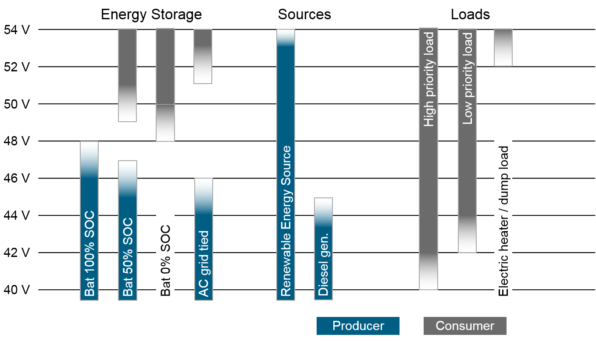

# DC System Layout

This chapter describes the components inside a DC based nanogrid including interfaces to the AC grid.

The energy management protocol mainly focuses on a DC nanogrid with multiple energy sources and sinks. An example system layout is shown in the following picture:

The main system level functions are:

- Current routing (wired connection between devices including switches and fuses)
- DC voltage control (e.g. for battery charging)
- Energy management (management of the state of charge of the batteries)

## Current routing

The components of the DC grid are electrically connected to each other via wires and possibly switches, fuses or plugs. The current flow takes the path of low impedance between the devices and can be controlled by current interrupt devices (e.g. switches) for safety and optimized management purposes.

On a high abstraction layer, the devices necessary for current routing can be divided into two categories: Distribution bus and bus connector/junction.

### Distribution bus

Hard-wired connections between two or more devices (sources/sinks) using the same cross-section everywhere.

Cross-section layout: Rated current = Sum of all source currents

The distribution bus can be thought of as a large copper plate where all current sources/sinks are connected to.

### Bus connector/junction

Connects two distribution buses of possibly different current ratings (i.e. wire cross-section) and contains a current interrupt device (e.g. fuses, MOSFETs, etc.)

Types of current interrupt devices:

- passive: 
	- Fuse or polyfuse?
	- Circuit breaker
- active: Switch
	- Semiconductor (e.g. MOSFET)
	- Relay

Further differentiation:

- uni-directional (e.g. MOSFET + possibly ideal diode control)
- bi-directional (fuse)

English term: Automatic Disconnection of Supply (ADS)

Passive: not suitable for DC bus signaling (see below), as current sources need to be overdimensioned to provide enough fuse tripping current --> only active switching useful

## Voltage control

The voltage in a DC system depends on the open circuit voltage of the connected voltage sources and the drop caused by the actual current flow via the included resistances (e.g. wire resistance, internal resistance of battery).

The voltage of the bus can be either dominated by a connected battery, or can be independently controlled if batteries are connected to the bus via a DC/DC converter.

### Battery-dominated voltage

If a battery is hard-wired to the DC bus, the open circuit voltage (OCV) of the battery defines the bus voltage without load. Under load, the voltage changes depending on the battery internal resistance and wire resistances.

For charging a battery, the voltage limits of the battery (charge profile) need to be communicated to all energy sources.

If multiple batteries are connected to the bus, all batteries need to be of the same type, otherwise valid charge profile control will be very complicated.

In the future, the energy management protocol should also support "smart" charging of multiple different batteries connected to one bus. This is possible with intelligent control of current interrupt devices connected between the battery and the bus.

### DC bus signaling

Using a DC/DC converter between all energy sources and the DC bus allows an independent control of the DC bus voltage.

In this case, the DC bus voltage is a measure for the system state and can be used for basic communication (e.g. a high voltage level means lots of available excess renewable energy in the system).

Load prioritization via different disconnect set-points is possible.

An overview of possible voltage set points in a 48V DC system is shown in the following picture:

